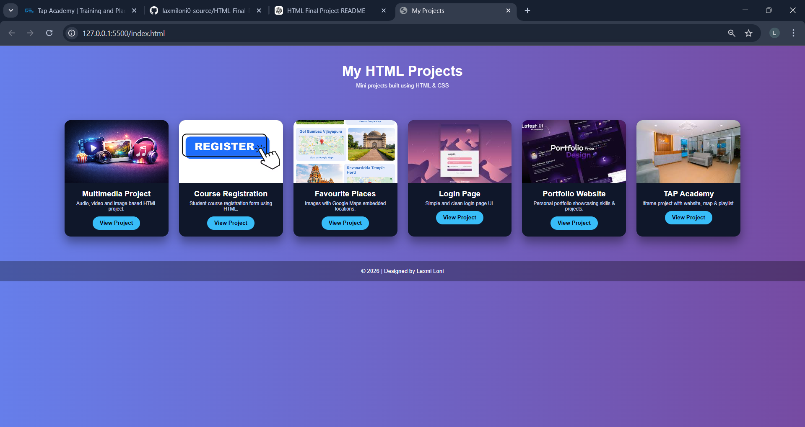
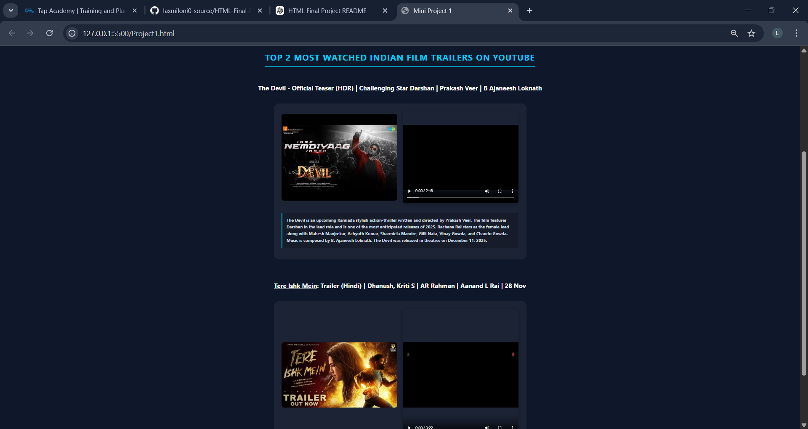
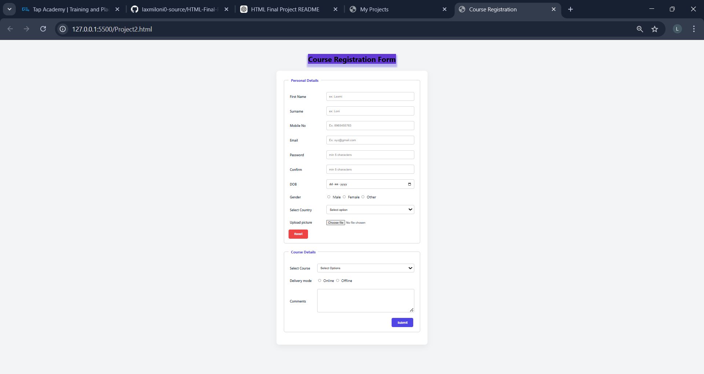
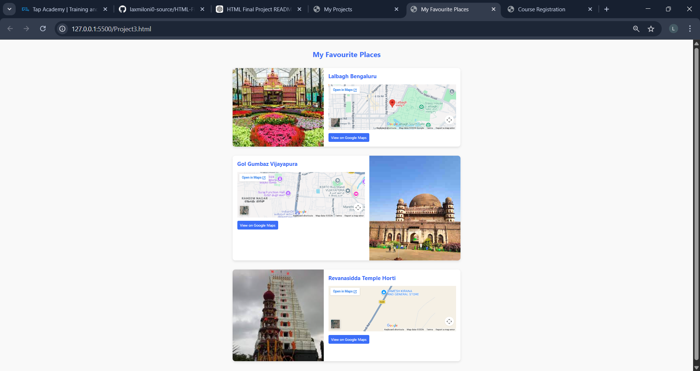
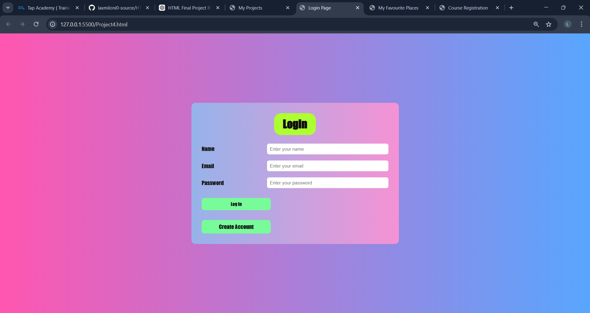
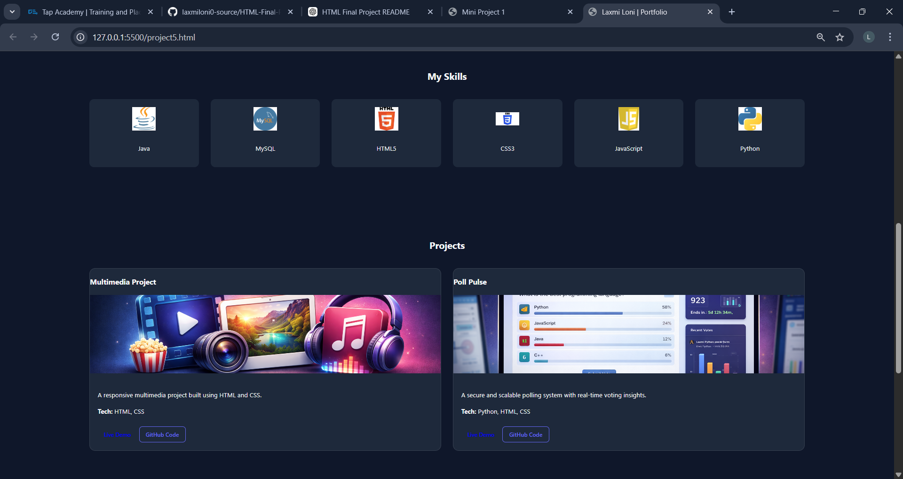
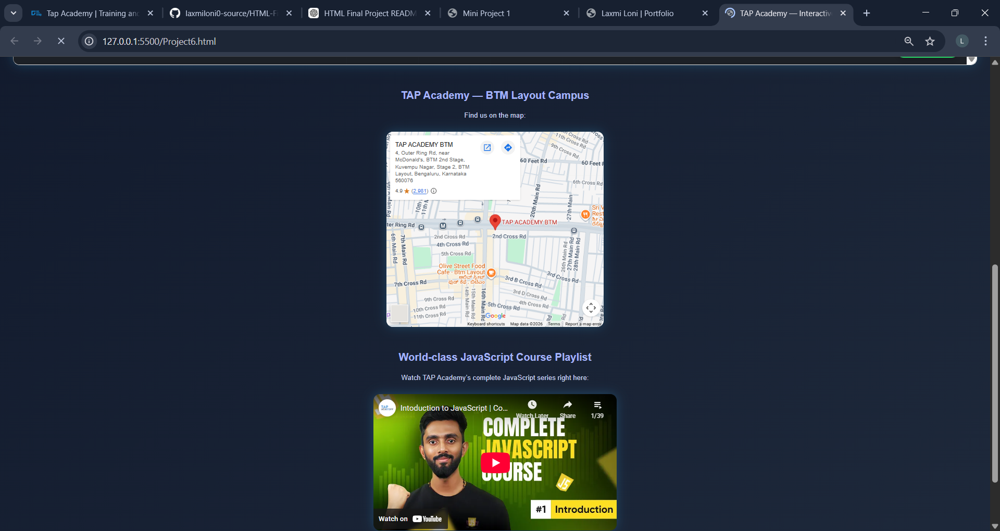

# HTML Final Project

## 📌 Project Overview

This repository contains multiple web development projects created using **HTML and CSS**.  
Each project demonstrates different concepts of webpage structure, layout, and styling.

---

## 🛠 Technologies Used

- HTML5
- CSS3
- Responsive Web Design

---

## 🚀 Features

- Simple and clean design
- Multiple webpages
- Navigation menu
- Images included
- CSS styling
- Responsive layout

---

## 📂 Projects Included

### 1️⃣ Multimedia Project

A webpage demonstrating the use of multimedia elements such as images and styled content using HTML and CSS.

---

### 2️⃣ Registration Form

A simple registration form created using HTML form elements to collect user information such as name, email, and password.

---

### 3️⃣ Favourite Location

A webpage displaying favourite places with images and descriptive content.

---

### 4️⃣ Login Page

A basic login page UI designed using HTML and CSS.

---

### 5️⃣ Portfolio Website

A personal portfolio website that includes:

- About section
- Skills section
- Projects showcase
- Resume download
- Contact information

---

### 6️⃣ Tap Academy Website

A website layout inspired by Tap Academy design using HTML and CSS.

---

## 📸 Project Preview

### Home Page



### Project Section

#### Project 1



#### Project 2



#### Project 3



#### Project 4



#### Project 5



#### Project 6



---

## 📂 Project Structure

```
HTML-Final-Project
│
├── index.html
├── project5style.css
├── README.md
│
└── assets
    ├── Laxmiphoto.jpg
    └── image
        ├── java.png
        ├── mysql.png
        ├── html.png
        ├── css.png
        ├── js.png
        ├── python.jpg
        ├── multi.png
        └── poll.png
```

---

## ▶️ How to Run the Project

1. Clone the repository

```
git clone https://github.com/laxmiloni0-source/HTML-Final-Project.git
```

2. Open the project folder

3. Open `index.html` in a browser

---

## 👩‍💻 Author

**Laxmi Loni**

GitHub:  
https://github.com/laxmiloni0-source

## 📌 Learning Outcome

Through this project I learned:

- HTML page structure
- CSS styling and layout
- Responsive web design
- Project organization
- Portfolio development
